# Huawei Watch GT 4 companion architecture

Status: target architecture and implementation contract. Hardware-dependent behavior remains unverified until it passes the real-device gate described in `huawei-watch-testing.md`.

## Existing Android application

The Android client is a Kotlin, Jetpack Compose, single-activity application. It uses repositories as the boundary between UI and data, OkHttp with Kotlin serialization for the mobile API, Room for offline persistence, and WorkManager for deferred server synchronization. Authentication uses the existing mobile bearer token on the phone. The token is encrypted with Android Keystore and must never be copied to the watch.

Room database `gymcoach-android.db` is currently schema version 4. Its workout source of truth is:

- `WorkoutDto`: the workout plan received in the mobile bootstrap.
- `ProgramExerciseDto`: the planned exercise, order, target sets, repetitions, RIR, rest, and related metadata.
- `LocalSessionEntity`: the durable workout session. An unfinished row is an active session.
- `LocalSetEntity`: the durable completed or edited set, with a stable client-generated ID.
- `SyncOutboxEntity`: the existing ordered phone-to-server mutation queue.

The watch integration must call the same repository operations that the Compose workout screen calls. It must not create a parallel workout, exercise, set, user, or server-authentication model.

## Repository layout

The existing project stays in place. New components use these boundaries:

```text
android/
  app/src/main/java/org/sharteman/gymcoach/watch/
    domain/       protocol-independent commands and runtime state
    data/         Room entities, DAOs, mappers, and repositories
    transport/    Wear Engine adapter and debug transport interface
    sync/         event journal, ACK handling, reconciliation, and conflicts
    sensors/      phone-side sensor DTOs and summaries, not watch sensor APIs
    simulator/    debug-source-set watch simulator only
    ui/           watch status, settings, and debug diagnostics
huawei-watch-app/
  ...             independent DevEco Studio Lite Wearable project
shared-contracts/
  ...             versioned schemas and cross-platform fixtures
docs/
  ...             capability, environment, architecture, protocol, and test docs
```

## Component view

```mermaid
flowchart LR
    subgraph Watch["Huawei Watch GT 4 Lite Wearable app"]
        WUI["Workout UI"]
        WSTATE["Local active-session snapshot"]
        WQUEUE["Durable event outbox and receipts"]
        WSENSORS["Runtime-gated sensor collectors"]
        WTRANSPORT["Wear Engine transport"]
        WUI --> WSTATE
        WSENSORS --> WSTATE
        WSTATE --> WQUEUE
        WQUEUE --> WTRANSPORT
    end

    subgraph Phone["Existing Android app"]
        PTRANSPORT["Wear Engine service adapter"]
        PSYNC["Watch event reconciler"]
        PRUNTIME["Active workout runtime state"]
        PROOM["Room: LocalSessionEntity and LocalSetEntity"]
        POUTBOX["Existing server sync outbox"]
        PUI["Compose workout and watch status UI"]
        PSIM["Debug-only watch simulator"]
        PTRANSPORT --> PSYNC
        PSYNC --> PRUNTIME
        PSYNC --> PROOM
        PROOM --> POUTBOX
        PROOM --> PUI
        PRUNTIME --> PUI
        PSIM -. debug transport .-> PSYNC
    end

    subgraph Server["Existing GymCoach server"]
        API["Authenticated mobile API"]
        DB["PostgreSQL history"]
        API --> DB
    end

    WTRANSPORT <-->|"messages under 1 KB; files under 4 MB"| PTRANSPORT
    POUTBOX --> API
```



## Data ownership and reuse

| Concept                                        | Durable representation                                            | Rule                                                                                                                                                                                     |
| ---------------------------------------------- | ----------------------------------------------------------------- | ---------------------------------------------------------------------------------------------------------------------------------------------------------------------------------------- |
| Workout plan                                   | `WorkoutDto` and `ProgramExerciseDto`                             | The phone sends a compact projection to the watch. The watch does not own a second editable program database.                                                                            |
| Workout session                                | Existing `LocalSessionEntity`                                     | The wire `WorkoutSession` is a projection of this row plus active runtime fields. It is not a new duplicate session table.                                                               |
| Exercise session                               | Derived from `ProgramExerciseDto` and session ID                  | It is a wire and UI projection. Do not persist a duplicate exercise-session row unless a later migration proves it necessary.                                                            |
| Completed set                                  | Existing `LocalSetEntity`                                         | A watch completion, edit, or deletion is applied through the existing repository transaction and server outbox.                                                                          |
| Active exercise, active set, pause, and timers | New `active_workout_state` row keyed by session ID                | This persists state that is currently Compose-only, including `activeExerciseId`, `activeSetId`, `setStartedAt`, `restEndsAt`, pause timestamps, revision, `updatedAt`, and `updatedBy`. |
| Watch events                                   | New event journal tables                                          | Store inbox receipts for deduplication, an ordered outbox until ACK, and sanitized error metadata.                                                                                       |
| Conflicts                                      | New `watch_sync_conflicts` table                                  | Preserve both versions, resolution status, timestamps, and sanitized reason. Never silently discard a user action.                                                                       |
| Sensor data                                    | New sensor batch/sample tables plus summaries on `LocalSetEntity` | Raw samples are buffered and written in batches. Set-level summaries extend the existing set record instead of creating another set entity.                                              |

Recommended phone-side additions are `ActiveWorkoutStateEntity`, `WatchEventJournalEntity`, `WatchSyncAckEntity`, `WatchSyncConflictEntity`, `SensorBatchEntity`, and `SensorSampleEntity`. The exact Room migration must remain additive and must include migration tests from every supported schema version.

On the watch, `WorkoutSession`, `ExerciseSession`, and `SetRecord` are compact local JSON projections backed by Lite Wearable storage. The watch retains the active snapshot, unacknowledged events, inbox receipt IDs, pending sensor batches, and the last acknowledged revision. Storage is bounded by deleting only acknowledged data after a verified snapshot and checksum.

## Android integration layers

### Domain

The domain layer accepts commands such as start, pause, resume, select exercise, start set, complete set, edit set, delete set, start rest, adjust rest, and finish workout. A command produces one or more protocol events. Both the Android UI and Wear Engine receiver use this same command boundary.

### Data

One Room transaction must:

1. Validate the command against the current session and revision.
2. Update `LocalSessionEntity`, `LocalSetEntity`, or `active_workout_state`.
3. Insert the watch event receipt and any required outbound response.
4. Enqueue the existing server mutation when durable workout history changed.

This preserves the current offline-first behavior and prevents the phone UI, watch UI, and server from observing partially applied changes.

### Transport

`WatchTransport` is an interface with a production Wear Engine implementation and a debug-only simulated implementation. It exposes discovery, connection state, message send/receive, file send/receive, and transport errors. Transport callbacks only decode and enqueue work. They do not mutate workout state directly.

The production adapter uses the phone as the trusted bridge. The watch receives a short-lived pairing context and protocol metadata, never the GymCoach bearer token, server cookie, base URL credentials, or encryption keys from Android Keystore.

### Sync

`WatchSyncCoordinator` owns protocol negotiation, durable delivery, ACKs, snapshot reconciliation, revision checks, and conflict creation. It serializes all commands for one session through a single ordered processor. Reconnection starts with a revision and outbox handshake before new UI commands are accepted.

### UI and diagnostics

Production UI shows watch model, connection, sync status, protocol version, last sync, supported sensors, current heart rate when permitted, pending count, and last sanitized error. Debug UI additionally exposes latency, queue details, conflict journal, forced snapshot, simulated disconnect/reconnect, duplicate delivery, and a redacted diagnostics export.

## Watch application

The watch project uses only the JavaScript, HML, CSS, Lite Wearable, and Wear Engine APIs confirmed by the capability audit. Every optional input or sensor is behind a runtime capability adapter:

```text
SensorCollector
  isSupported()
  requestPermission()
  start(sessionContext)
  stop()
  getCurrentValue()
  flushSamples()
```

Production collectors must never synthesize unsupported values. Crown input, wrist detection, accelerometer, heart rate, vibration, and other features are enabled only when both official documentation and runtime probing confirm them on the connected GT 4 firmware. Unsupported features use touch controls or are omitted. Debug fakes stay outside the production bundle.

The round 466 x 466 UI has small, recoverable screens: home and connection, active workout, set entry, rest, exercise summary, workout summary, and diagnostics. Numeric edits use touch first. Crown editing is an enhancement, not a requirement, until the exact device reports support.

## Timers and lifecycle

Workout, set, rest, pause, and recovery timers use absolute timestamps. UI ticks calculate `now - startedAt` or `restEndsAt - now`; no persisted counter is incremented once per second. The watch checkpoints active state after each command and on lifecycle transitions. Reopening reconstructs the timer from timestamps and requests a phone snapshot when connected.

Official Lite Wearable background and screen-off restrictions do not justify a promise of continuous heart-rate collection. The implementation must stop subscriptions when required by the platform, checkpoint buffered samples, and clearly mark gaps. Screen-off, process-death, and background sensor behavior are release blockers for the real-watch test gate.

## Sensor pipeline

Collectors add timestamped samples to an in-memory bounded buffer. A storage writer flushes by sample count, elapsed time, lifecycle transition, set completion, rest completion, and memory pressure. Invalid or off-wrist values are stored with validity metadata and excluded from min, max, and average calculations. Zero is never substituted for a missing heart rate.

Raw data is associated with session, exercise, set, phase, sensor type, unit, source, and validity. Phases are `WORKOUT`, `SET`, `REST`, `PAUSE`, `WARMUP`, and `RECOVERY`. Set and rest summaries are derived deterministically from valid timestamped samples. These values are fitness analytics, not medical measurements or diagnoses.

## Main flows

### Start on phone

1. The existing repository creates `LocalSessionEntity` and server outbox operation.
2. `active_workout_state` is initialized from the selected `WorkoutDto`.
3. The sync coordinator sends a compact `SYNC_SNAPSHOT`.
4. The watch stores the snapshot before rendering it.
5. The watch ACKs the snapshot revision.

### Complete a set on watch

1. The watch writes a local `SET_COMPLETED` event and set record atomically.
2. It computes a sensor summary and starts rest from an absolute `restEndsAt`.
3. Wear Engine delivers the event immediately or after reconnection.
4. The phone deduplicates `eventId`, validates revision, and upserts the existing `LocalSetEntity`.
5. The same transaction enqueues the existing `UPSERT_SET` server operation and an ACK.
6. Both devices render the applied revision.

### Reconnect

1. Each side advertises protocol version, session ID, current revision, last acknowledged revision, and pending count.
2. Missing contiguous events are replayed in journal order.
3. A revision gap or journal truncation triggers `SYNC_REQUESTED` and `SYNC_SNAPSHOT`.
4. Sensor files are resumed independently by batch ID and checksum.
5. A conflict is stored and surfaced instead of being overwritten.

## Security and privacy

- Request only permissions required by a confirmed production collector.
- Keep the GymCoach token and server access on the Android phone.
- Do not log tokens, user names, exercise notes, raw health data, or complete payloads.
- Redact device IDs and hash session IDs in exported diagnostics.
- Store signing keys, certificates, profiles, account data, and passwords outside Git.
- Separate production and debug transports by source set and build flag.
- Do not send workout or sensor data to any third party.
- Use the existing HTTPS server configuration for phone-to-server synchronization.

## Delivery stages

1. Audit and capability matrix, environment inventory, contracts, and this architecture.
2. Minimal signed watch app, connection status, ping/pong, Previewer UI, and simulated transport.
3. Active snapshot, exercise changes, set entry, and existing `LocalSetEntity` integration.
4. Runtime-gated sensors, summaries, absolute timers, and supported vibration.
5. Durable offline journals, reconnection, revision reconciliation, and conflict diagnostics.
6. Automated suites, real-device verification, installation runbook, and release evidence.

Each stage requires both projects to build, all applicable tests to pass, and a separate focused Git commit. A stage that depends on GT 4 hardware remains incomplete until its real-device evidence is recorded.

## Official references

- [Wear Engine service introduction](https://developer.huawei.com/consumer/en/doc/connectivity-Guides/service-introduction-0000000000018585)
- [Lite Wearable overview](https://developer.huawei.com/consumer/en/doc/harmonyos-guides-V3/lite-wearable-overview-0000001197577411-V3)
- [Lite Wearable SDK](https://developer.huawei.com/consumer/en/doc/connectivity-Library/litewearable-sdk-cn-0000001705004353)
- [Integrating the fitness watch SDK](https://developer.huawei.com/consumer/en/doc/connectivity-Guides/integrating-fitnesstwatch-sdk-0000001052859174)
- [Lite Wearable background tasks](https://developer.huawei.com/consumer/en/doc/harmonyos-guides-V3/background-task-overview-0000001333640869-V3)
